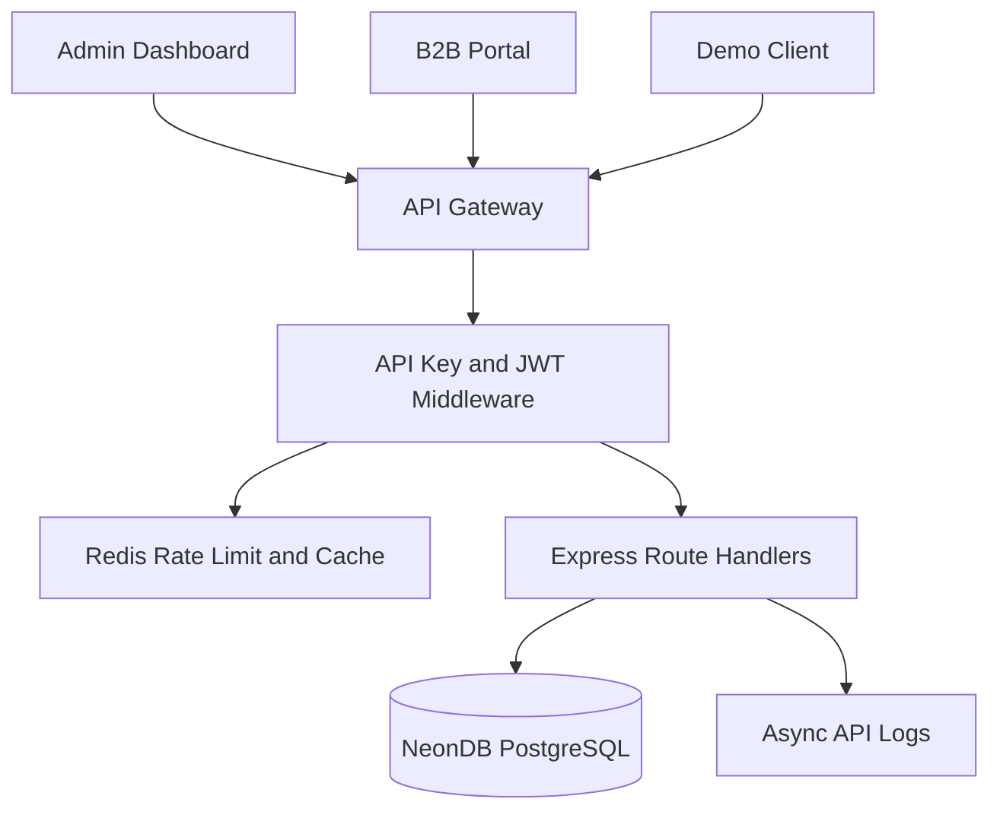

# Architecture

## Layers

## Request Flow

1. Client sends `X-API-Key` and, for write operations, `X-API-Secret`.
2. Security middleware applies headers, CORS, request IDs, and rate metadata.
3. API key middleware validates credentials and plan access.
4. Route handler queries cached data or PostgreSQL.
5. Response returns the standard `{ success, count, data, meta }` envelope.
6. Usage is logged asynchronously for analytics.

## Production Notes

- Use Neon pooled connection strings for serverless deployments.
- Store API secrets as bcrypt hashes only.
- Put Redis-backed daily and burst limits in front of route handlers.
- Keep import jobs outside the request path; run ETL as a controlled batch process.
